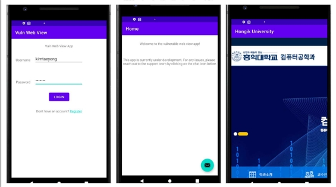
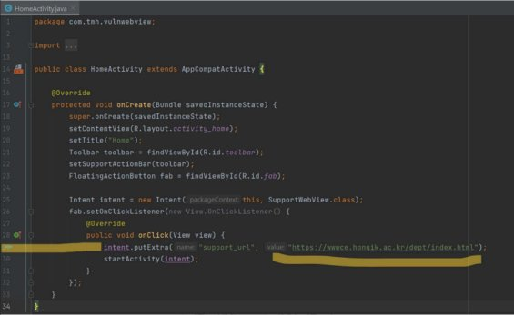

|1. 구현 어플리케이션 설명 |
| - |
|
Webview의  취약점을  파악하기  위해  1)  로그인  기능  2)  webview를  통해  web을  화면에 띄우는 기능을 가지고 있는 어플리케이션이다. 

1) 로그인 기능 

Username에 kimtaeyong, Password에 c011060을 입력하면 로그인이 수행된다. 

2) Webview 기능 

로그인이  된  후,  우측  하단에  문자  표시  버튼을  누르면,  홍익대학교  컴퓨터공학과 홈페이지를 webview를 통해 띄운다.  

|
|2. 취약점에 대한 공격 재현 |
|
adb  shell  am  start  -n  com.tmh.vulnwebview/.SupportWebView  --es  support\_url "https://www.google.com" 을 adb 명령어로 실행한다. 

그러면 홍익대학교 컴퓨터공학과 홈페이지에서 구글 홈페이지로 webview가 변경된다. 
|

|
동시에, cmd창에는  Starting: Intent { cmp=com.tmh.vulnwebview/.SupportWebView (has extras) }이라는 문구가 출력된다. 

|
| :- |
|3. 구현  어플리케이션  취약점  설명 |
|Webview는 안드로이드 어플리케이션에서 사용자에게 웹을 보여주는 안드로이드 컴포넌트 이다.  Webview는  JavaScript를  지원하기  때문에,  이를  이용한  취약점이  발생할  수  있다. 특히, 평문으로 URL을 로딩하는 경우에 중간자 공격에 취약하다. |

재현한 취약점 공격은 원래 개발자가 의도한 web의 URL를 띄워줘야 하는데, 공격자가 이 URL 주소를 중간에 변경하여, 공격자가 의도한 web page를 사용자에게 보여주는 공격이 다. 

이  공격은  공격자가  악의적인  web  page를  사용자의  디바이스에  보여줄  수  있기  때문에 매우 위험한 공격이다. 

AndroidManifest.xml  파일에  Webview를  사용할  수  있게  <uses-permission android:name=”android.permission.INTERNET”/>이 있다. 

컴포넌트가 intent-filter을 가질 때, exported=”false” attribute가 없다. 

이 공격에 대응하는 방안은 다음과 같다. 

1) Webview의 동작을 제한하는 코드 추가 
1) 필요하지 않는 API 제한 
1) JavaScript를 사용하지 않게 하는 setJavaScriptEnabled(false) 코드 추가 
Network Security 2022 Spring                         4                                           
